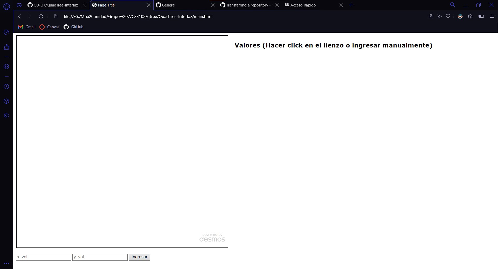
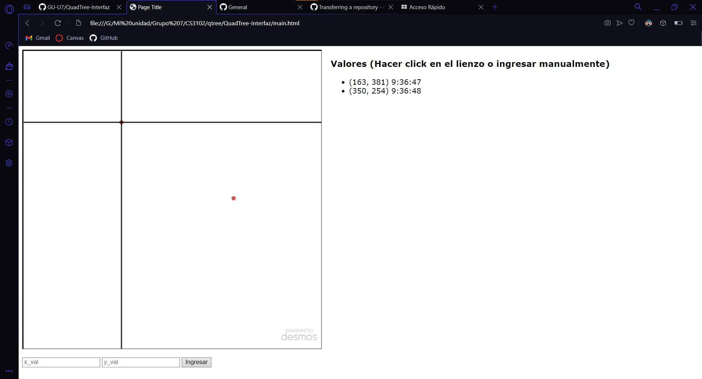

# QuadTree-Interfaz

## Enunciado
- Laboratorio 3: QuadTree. Inserción, interfaz visual
- Entrega: miércoles 14 de septiembre, 6:59 pm


## Ejecución

1. Abrir archivo ```main.html``` en explorador.
2. Aparecerá la siguiente visualización:

3. Se pueden ingresar puntos de las siguientes maneras:
    1. Hacer click en el lienzo y se procederá a crear coordenadas en la ubicación del cursor
    2. Ingresar manualmente valores de coordenadas en el formulario inferior al lienzo
4. Al insertar coordendas, aparecerán los puntos creados a la derecha del lienzo
